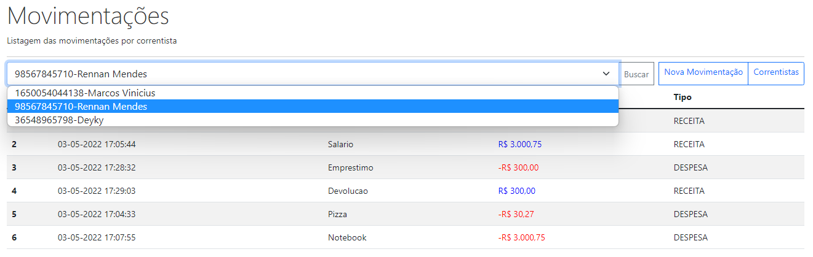
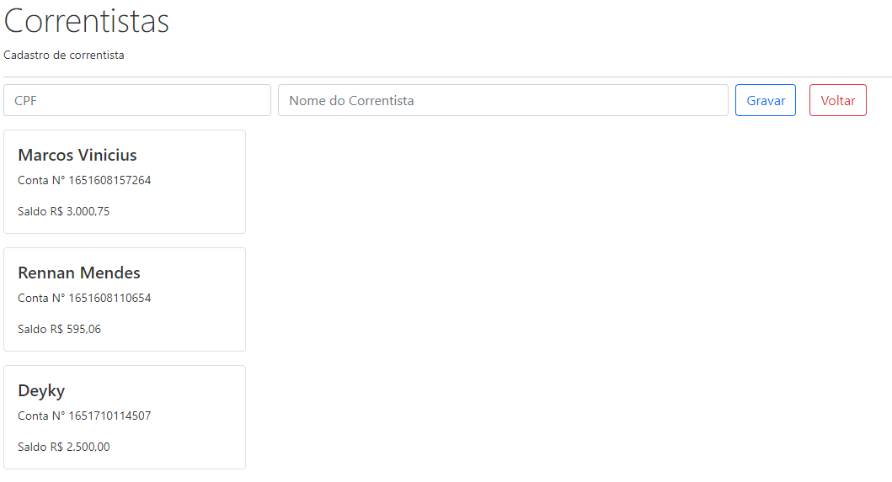
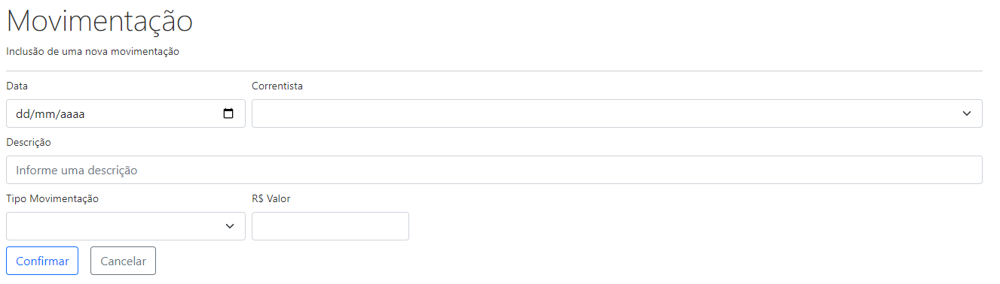

<h1 align="center">SANTANDER DEV WEEK</h1>
<h2 align="center">Front-end </h2>

 

• <a href="#Objetivo">Objetivo</a>
 • <a href="#Preparação">Preparação</a> 
 • <a href="#Tecnologias">Tecnologias</a>
 • <a href="#Funcionalidades-do-projeto">Funcionalidades</a>

## Objetivo 
Criar uma interface visual e de fácil utilização para consumir uma API de domínio bancário capaz de cadastrar novos usuários e acompanhar suas movimentações financeiras.

 

## Preparação

Será necessario ter o [bankline-api](https://github.com/RennanMendes/bankline-api) baixado e em execução no seu computador durante a utilização desta solução.

Além disto você precisara de uma IDE, como por exemplo o [Visual Studio Code](https://code.visualstudio.com/).

 

## Tecnologias

Foram utilizadas as seguintes tecnologias:

- <b>Angular</b>
- <b>HTML5</b>
- <b>CSS3</b>
- <b>JavaScript</b>
- <b>TypeScript</b>
- <b>NodeJS</b>
- <b>VScode</b>

 

##  Funcionalidades do projeto

#### Exibe as movimentações feitas por cada usuário

 

#### Cadastra novos usuário

 

#### Realiza novas movimentações

 

